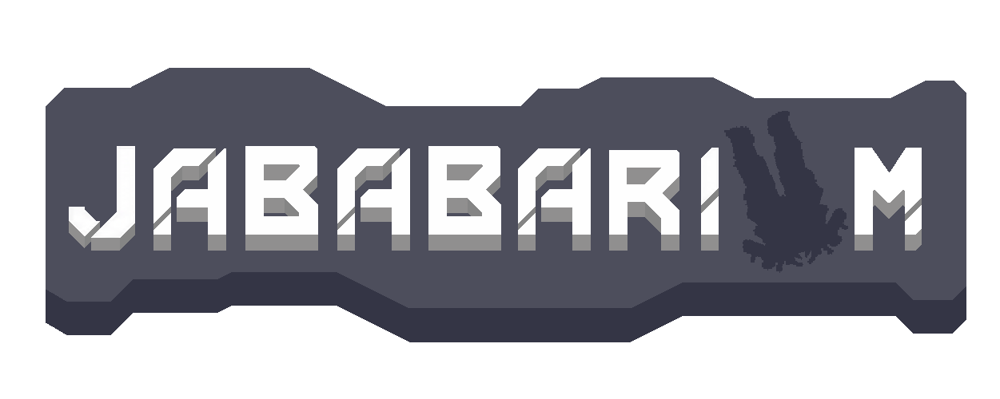
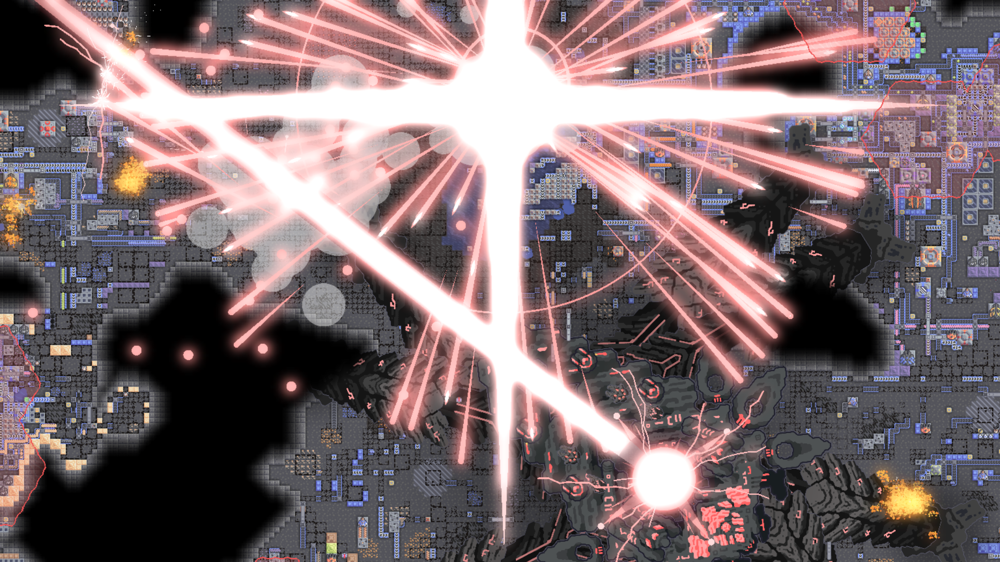
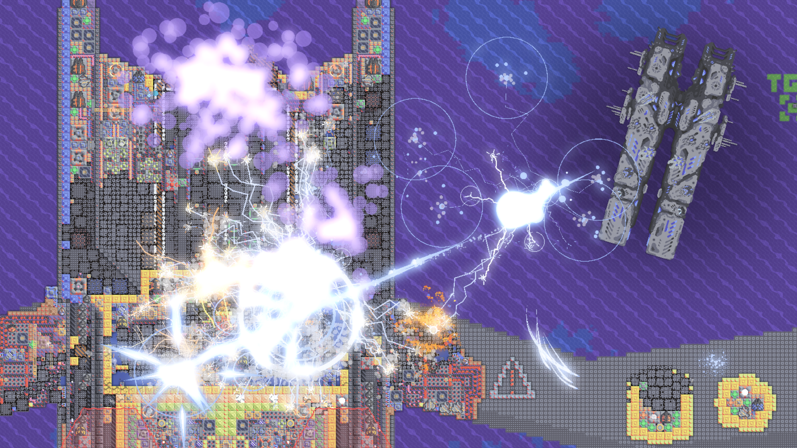
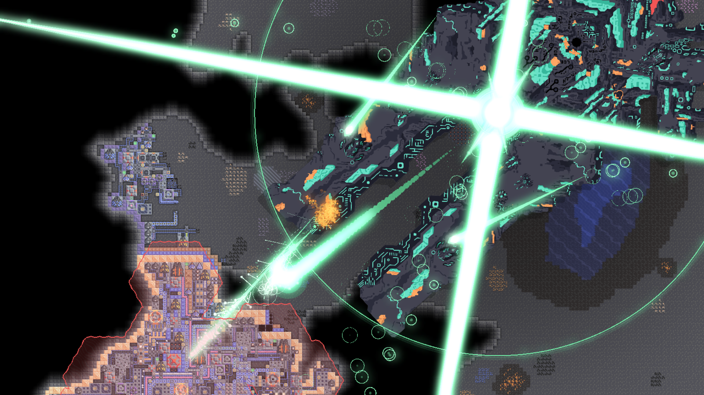
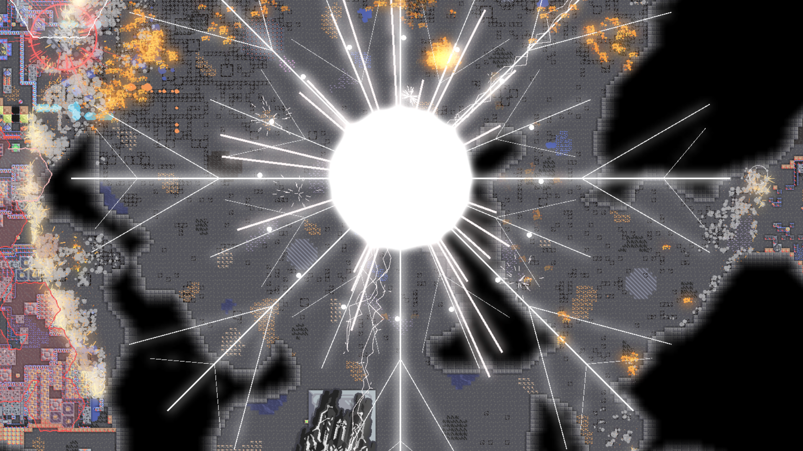

> A Mindustry v8 mod

> [!WARNING]
> **This mod is a work in progress.** Expect bugs, missing content, placeholder sprites, and balance that isn't final. Save compatibility between versions is **not guaranteed** - updating mid-campaign may break your save.
>
> If you want a stable experience, wait for the first full release. If you enjoy testing and giving feedback, you're very welcome here.

---

## Overview

Just adds a lot of stuff

---

## Features

- **New Blocks**
- **New Units**
- **New Items / Liquids**

---

## Screenshots

|                                                     |
| --------------------------------------------------- |
|  |
|  |
|  |
|  |

---

## Balance Philosophy

- This mod is meant to complement vanilla by adding new content to the each phase of the game.
- End-game blocks are intentionally expensive.
- Units are powerful but require significant infrastructure.
- Balance is intentionally rough during beta - numbers will change significantly

---

## Development Status & Roadmap

**Current phase:** Beta - core content is playable but incomplete. Feedback on balance and bugs is especially helpful right now.

### Content completion

| Category                    | Status      | Notes                                              |
| --------------------------- | ----------- | -------------------------------------------------- |
| Items & Liquids             | Done        | May rebalance                                      |
| Drills & resource buildings | Done        | May rebalance                                      |
| Power generation            | Done        | May rebalance                                      |
| Defense blocks              | Done        | May rebalance                                      |
| Units                       | In progress | Several units' branches in progress. May rebalance |
| Localization                | Not started | After content freeze                               |
| Campaign integration        | Not started | Long-term goal                                     |

## Contributing

Contributions are welcome. If you want to help:

1. Fork the repository
2. Create a feature branch: `git checkout -b feature/my-feature`
3. Commit your changes: `git commit -m "Add my feature"`
4. Push and open a Pull Request

For art contributions, we would appreciate any sprites.

---

### Credits

- **Shroud**, **kadi4ok** - code
- **he1ixo**, **goman777joy**, **猩红** - sprites

---

## Support

- **Bugs / Suggestions**: [GitHub Issues](https://github.com/Shroud-y/Jababarium/issues)
- **My discord**: mr.wilol
- **kadi4ok's discord**: medusa5098460
- **For any sprites questions he1ixo's discord**: he1ixo
